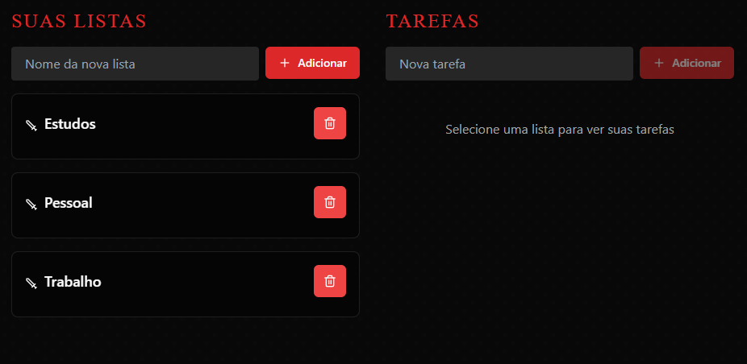

# 🛡️⚔️ berserk-tasks

Este é um projeto de **To Do List** (Lista de Tarefas) que criei como fã berserk!  
O projeto foi feito utilizando **React**, com animações usando **Framer Motion** e ícones do **Lucide React**.

📍 **Acesse online:** [https://berserk-tasks.rennan-alves.com/login](https://berserk-tasks.rennan-alves.com/login)



## 🔥 Funcionalidades

- Criar listas de tarefas personalizadas.
- Adicionar tarefas dentro de listas específicas.
- Marcar tarefas como concluídas.
- Deletar tarefas e listas.
- Persistência de dados usando **MySQL**.
- Notificações amigáveis com **Toast**.

## 🛠️ Tecnologias Utilizadas

- [React](https://react.dev/)
- [Framer Motion](https://www.framer.com/motion/)
- [Lucide React](https://lucide.dev/)
- [PHP](https://www.php.net/) (backend para comunicação com o banco de dados)
- [MySQL](https://www.mysql.com/) (banco de dados relacional)
- [Shadcn/UI](https://ui.shadcn.dev/) (para botões e toasts)

### ✅ Requisitos

- [Node.js](https://nodejs.org/) versão 16 ou superior
- [npm](https://www.npmjs.com/) ou [yarn](https://yarnpkg.com/)

## 🚀 Como rodar o projeto

1. Clone o repositório:
   ```bash
   git clone https://github.com/rennan-dev/berserk-tasks.git
   ```

2. Acesse a pasta do projeto:
   ```bash
   cd berserk-tasks
   ```

3. Instale as dependências:
   ```bash
   npm install
   ```

4. Rode o projeto:
   ```bash
   npm run dev
   ```

5. Abra o navegador e acesse:
   ```
   http://localhost:5173
   ```

## 📦 Estrutura do Projeto

- `TaskManager.jsx` - Componente principal da aplicação, gerencia a criação de listas e tarefas.
- `components/ui` - Componentes de UI reutilizáveis como Button e Toast.
- `index.css` - Estilização global com tema medieval.

## 🎨 Layout

- Estilo inspirado em um dos meus animes favoritos (Berserk).
- Títulos estilizados (`medieval-title`).
- Ícones de espada e lixeira para representar listas e tarefas.

## 💾 Salvamento

As listas e tarefas são salvas automaticamente no navegador usando **MySQL**, então mesmo após recarregar a página, seus dados continuam lá.

## 📄 Licença
Este projeto está licenciado sob os termos da [Licença MIT](./LICENSE).

Feito por Rennan Alves.
